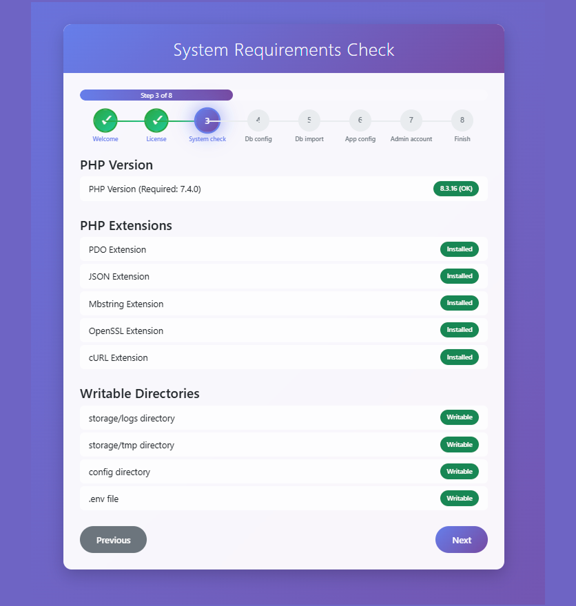
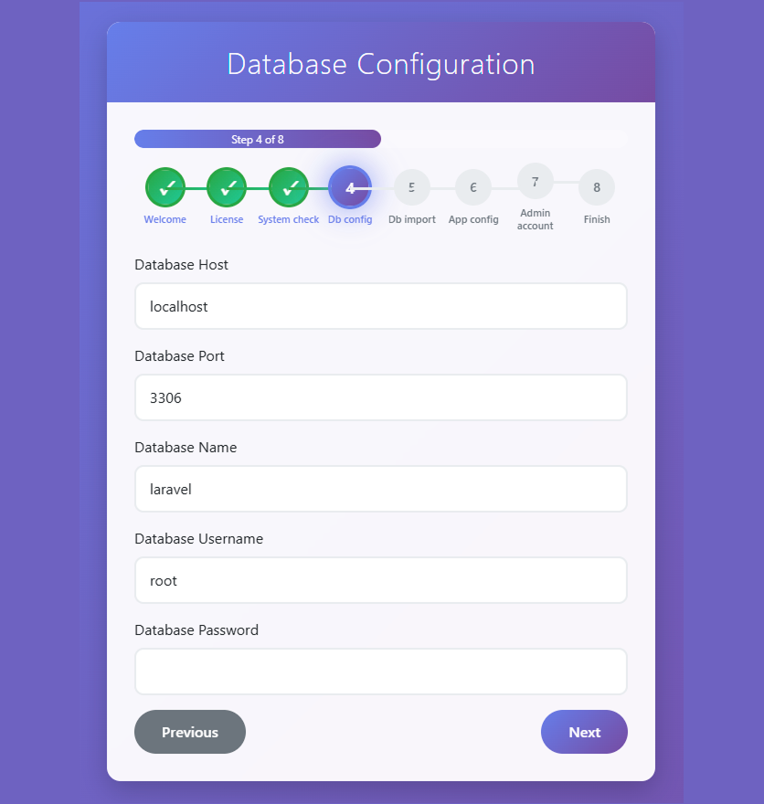
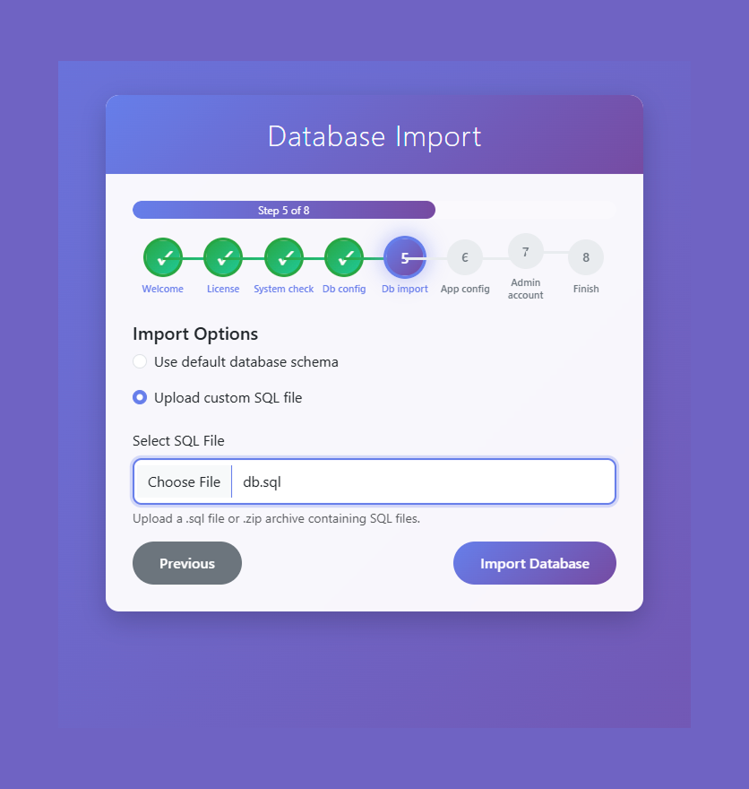
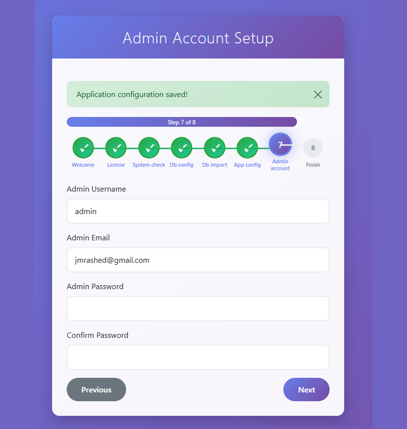
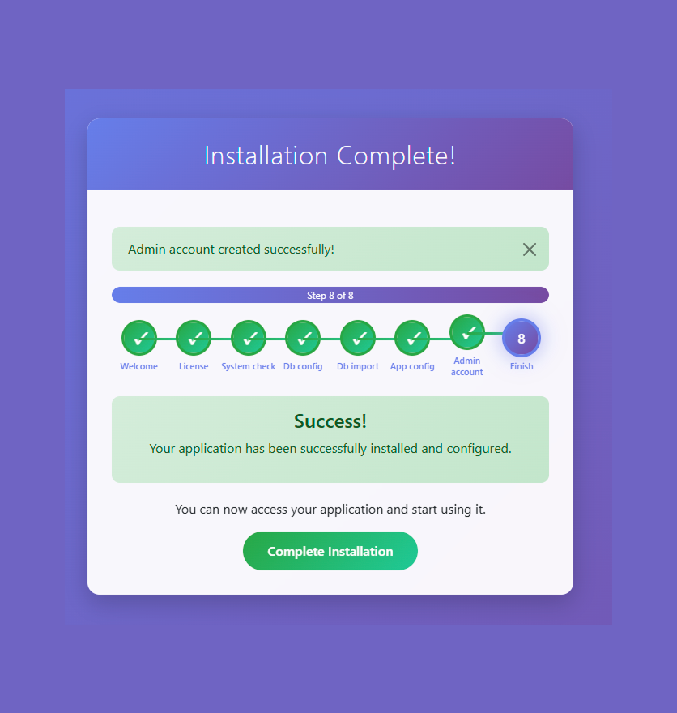
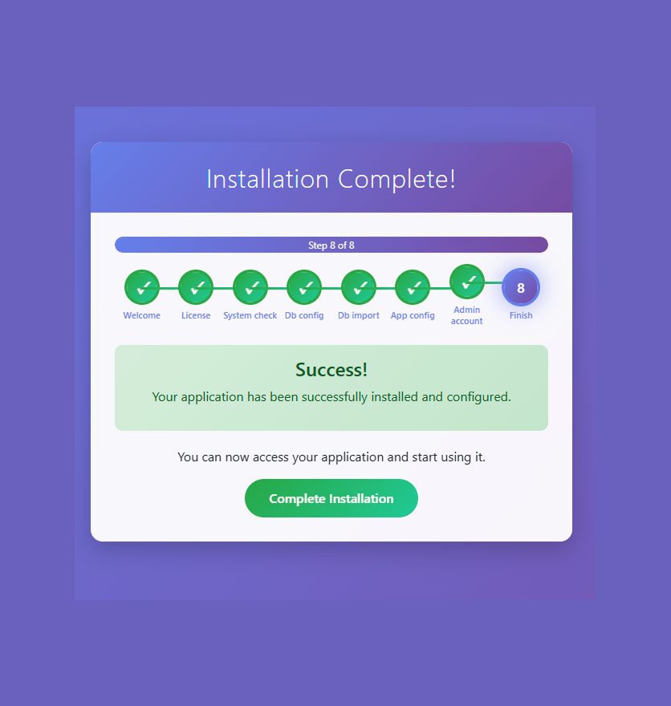

# PHP Installer Package

[](https://opensource.org/licenses/MIT)
[](https://php.net/)
[](https://github.com/jmrashed/php-installer/releases)

A professional, reusable web installer for any PHP application. Simplify your deployment process with an intuitive step-by-step installation wizard.

## ✨ Features

- **System Requirements Check** - Validates PHP version, extensions, and directory permissions
- **Database Setup** - Automated database creation and schema import
- **PHP Migration Support** - Execute PHP-based migrations and seeders
- **Configuration Management** - Generates application config files
- **Admin Account Creation** - Optional administrator user setup
- **Installation Lock** - Prevents reinstallation after completion
- **CSRF Protection** - Secure form handling
- **Responsive UI** - Bootstrap-powered interface
- **Debug Control** - Environment-based debug output control
- **Error Handling** - Comprehensive validation and user feedback

## 🚀 Quick Start

### Installation

```bash

composer require jmrashed/php-installer

# Clone the repository
git clone git@github.com:jmrashed/php-installer.git

# Or download and extract to your project
wget https://github.com/jmrashed/php-installer/archive/main.zip
```

### Integration

1. Copy the `php-installer` folder to your project root
2. Create your database schema file at `database/db.sql`
3. Configure installer settings in `config/installer.php`
4. Access via browser: `http://yourdomain.com/php-installer/`

## 📋 Requirements

- PHP 7.4 or higher
- PDO extension
- MySQL/MariaDB database
- Web server (Apache/Nginx)

## 🛠️ Configuration

# Screenshot














 


### Basic Setup

Edit `config/installer.php`:

```php
<?php
return [
    'app_name' => 'Your Application',
    'version' => '1.0.0',
    'php_version' => '7.4',
    'required_extensions' => ['pdo_mysql', 'curl', 'mbstring'],
    'writable_dirs' => ['config', 'storage', 'uploads'],
    'database_file' => __DIR__ . '/../database/db.sql',
    'migration_support' => true,
    'migration_path' => __DIR__ . '/../database/migrations',
    'seeder_path' => __DIR__ . '/../database/seeders',
    'supported_databases' => [
        'mysql' => ['name' => 'MySQL', 'extension' => 'pdo_mysql', 'default_port' => '3306'],
        'pgsql' => ['name' => 'PostgreSQL', 'extension' => 'pdo_pgsql', 'default_port' => '5432'],
        'sqlite' => ['name' => 'SQLite', 'extension' => 'pdo_sqlite', 'default_port' => null]
    ]
];
```

### Database Schema

#### Option 1: SQL Schema File
Place your SQL schema in `database/db.sql`:

```sql
CREATE TABLE users (
    id INT AUTO_INCREMENT PRIMARY KEY,
    username VARCHAR(50) UNIQUE NOT NULL,
    email VARCHAR(100) UNIQUE NOT NULL,
    password VARCHAR(255) NOT NULL,
    created_at TIMESTAMP DEFAULT CURRENT_TIMESTAMP
);
```

#### Option 2: PHP Migrations (Recommended)
Create PHP migration files in `database/migrations/`:

```php
<?php
// 2024_01_01_000001_create_users_table.php
return function ($pdo) {
    $pdo->exec("
        CREATE TABLE IF NOT EXISTS users (
            id INT AUTO_INCREMENT PRIMARY KEY,
            username VARCHAR(50) UNIQUE NOT NULL,
            email VARCHAR(100) UNIQUE NOT NULL,
            password VARCHAR(255) NOT NULL,
            created_at TIMESTAMP DEFAULT CURRENT_TIMESTAMP
        )
    ");
    echo "✅ Table 'users' created.\n";
};
```

#### Seeders
Create seeder files in `database/seeders/`:

```php
<?php
// AdminSeeder.php
return function ($pdo) {
    $stmt = $pdo->prepare("INSERT INTO users (username, email, password) VALUES (?, ?, ?)");
    $stmt->execute(['admin', 'admin@example.com', password_hash('admin123', PASSWORD_DEFAULT)]);
    echo "✅ Admin user seeded.\n";
};
```

## 📁 Directory Structure

```
php-installer/
├── config/
│   └── installer.php          # Configuration settings
├── database/
│   └── db.sql                 # Database schema
├── public/
│   └── index.php              # Entry point
├── src/
│   ├── Core/                  # Core installer classes
│   ├── Controllers/           # Request handlers
│   ├── Views/                 # UI templates
│   ├── Assets/                # CSS, JS, images
│   └── Templates/             # Config templates
└── storage/
    ├── logs/                  # Installation logs
    └── installer.lock         # Installation lock file
```

## 🎯 Usage Example

### For Laravel Projects

```php
// config/installer.php
return [
    'app_name' => 'Laravel Application',
    'required_extensions' => ['pdo_mysql', 'mbstring', 'openssl', 'tokenizer'],
    'writable_dirs' => ['storage', 'bootstrap/cache'],
    'migration_support' => true,
    'migration_path' => __DIR__ . '/../database/migrations',
    'seeder_path' => __DIR__ . '/../database/seeders'
];
```

### For Custom PHP Projects

```php
// config/installer.php
return [
    'app_name' => 'Custom PHP App',
    'required_extensions' => ['pdo_mysql', 'curl', 'gd'],
    'writable_dirs' => ['uploads', 'cache', 'logs'],
    'migration_support' => true,
    'migration_path' => __DIR__ . '/../database/migrations',
    'seeder_path' => __DIR__ . '/../database/seeders'
];
```

### Installation Options

During the database import step, users can choose:

1. **Run database migrations & seeders** (Recommended)
   - Executes PHP migration files
   - Runs seeder files after migrations
   - Provides detailed logging

2. **Use default database schema**
   - Imports from `database/db.sql`
   - Traditional SQL file approach

3. **Upload custom SQL file**
   - Allows custom `.sql` or `.zip` uploads
   - Useful for existing database schemas

## 🔧 Customization

### Debug Control

Control debug output using your application's `.env` file:

```env
# Enable debug output during installation
APP_DEBUG=true

# Disable debug output for production
APP_DEBUG=false
```

Alternatively, add `?debug=1` to any installer URL for temporary debugging.

### Custom Installation Steps

Extend the installer by modifying `src/Core/Installer.php`:

```php
private $steps = [
    'welcome',
    'license',
    'system_check',
    'db_config',
    'db_import',
    'app_config',
    'admin_account',
    'custom_step',    // Add your custom step
    'finish'
];
```

### Migration and Seeder Integration

The installer automatically detects and runs:
- **PHP Migrations**: Files in `database/migrations/*.php`
- **Seeders**: Files in `database/seeders/*.php` (run after migrations)
- **SQL Files**: Traditional `.sql` files as fallback

### Custom Templates

Create custom config templates in `src/Templates/`:

- `config_template.php` - Application configuration
- `env_template.php` - Environment variables

## 📋 Changelog

See [CHANGELOG.md](CHANGELOG.md) for a detailed list of changes and version history.

## 🤝 Contributing

1. Fork the repository
2. Create your feature branch (`git checkout -b feature/amazing-feature`)
3. Commit your changes (`git commit -m 'Add amazing feature'`)
4. Push to the branch (`git push origin feature/amazing-feature`)
5. Open a Pull Request

## 📝 License

This project is licensed under the MIT License - see the [LICENSE](LICENSE) file for details.

## 👨‍💻 Author

**Md Rasheduzzaman**  
Full-Stack Engineer & Technical Project Manager

- Email: jmrashed@gmail.com
- GitHub: [@jmrashed](https://github.com/jmrashed)
- LinkedIn: [Md Rasheduzzaman](https://linkedin.com/in/jmrashed)

## 🙏 Acknowledgments

- Bootstrap for the responsive UI framework
- PHP community for best practices and standards

## 📊 Stats


---

⭐ **Star this repository if it helped you!**