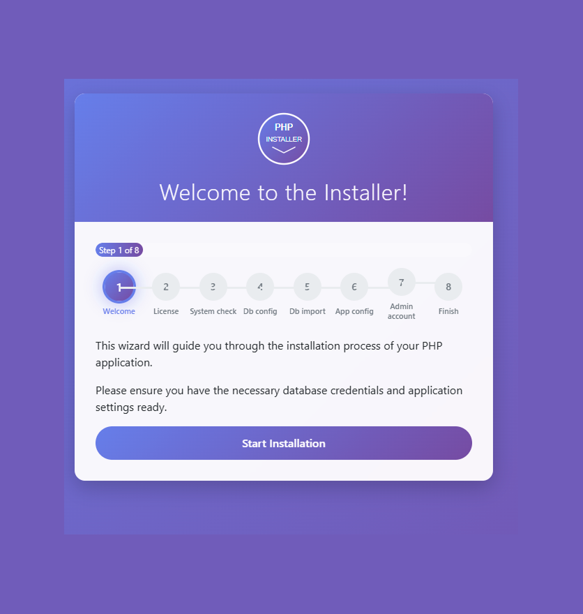
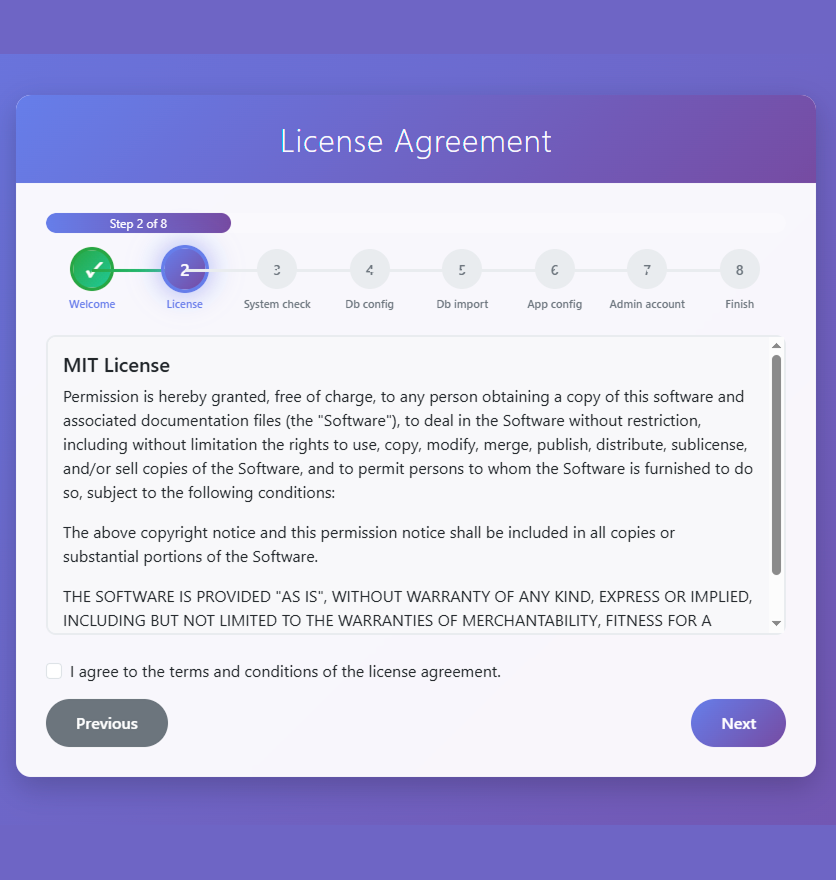
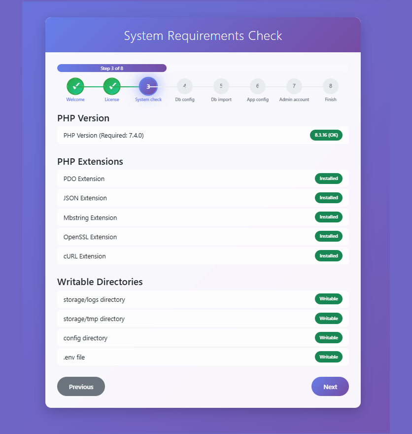
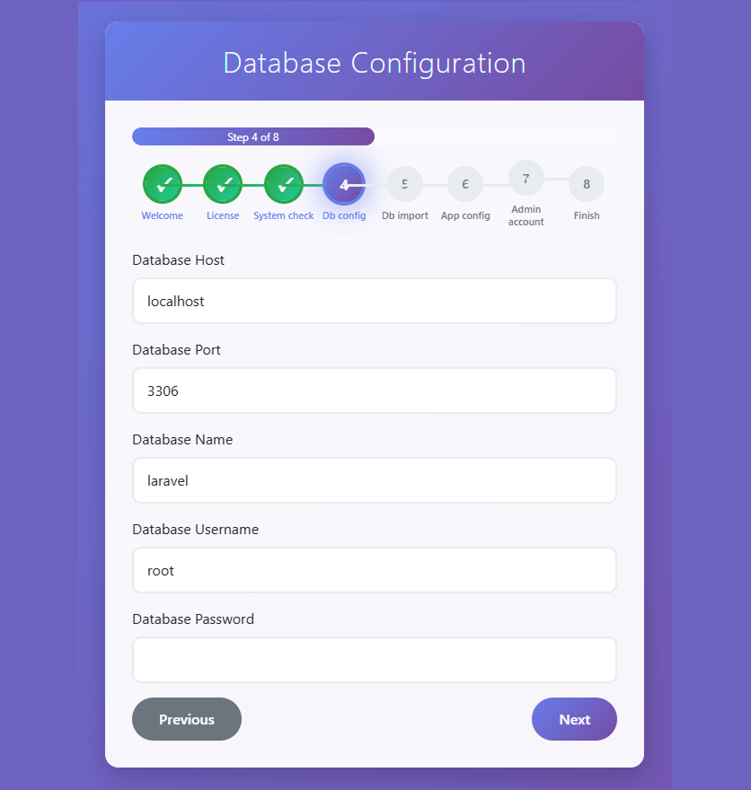
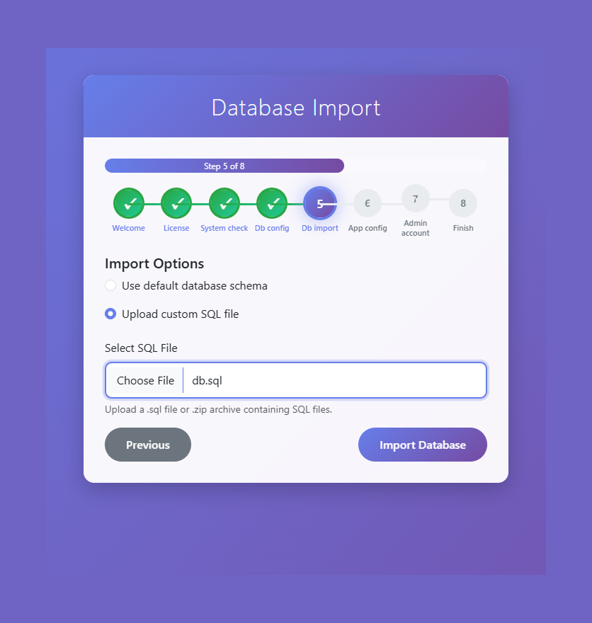
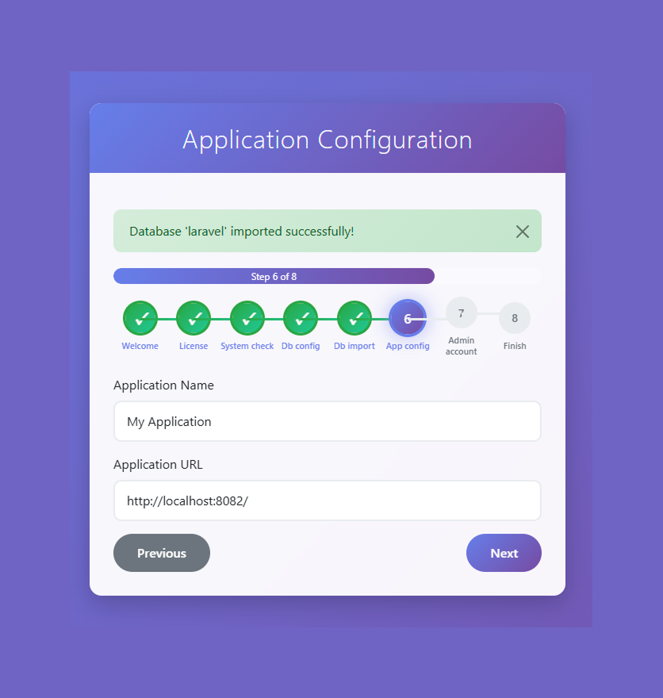
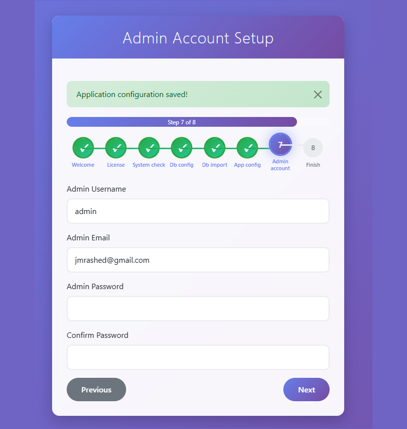
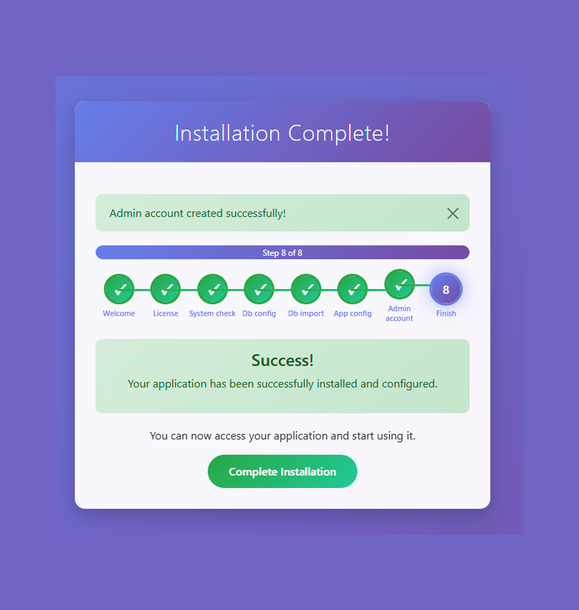
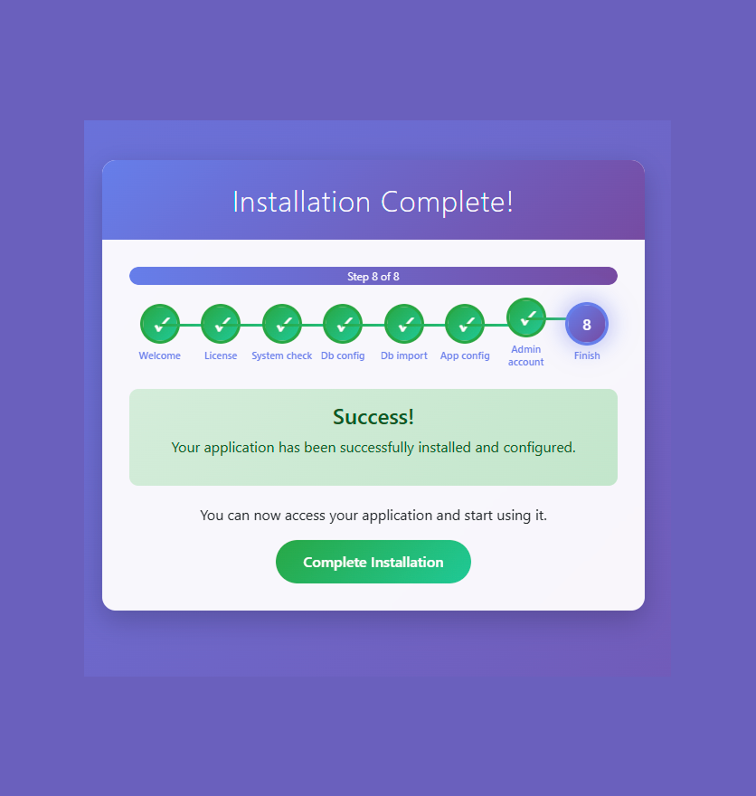

# PHP Installer Package

[](https://github.com/jmrashed/php-installer/actions/workflows/ci.yml)
[](https://opensource.org/licenses/MIT)
[](https://php.net/)
[](https://github.com/jmrashed/php-installer/releases)

A professional, reusable web installer for any PHP application. Simplify your deployment process with an intuitive step-by-step installation wizard.

## ✨ Features

- **System Requirements Check** - Validates PHP version, extensions, and directory permissions
- **Database Setup** - Automated database creation and schema import
- **PHP Migration Support** - Execute PHP-based migrations and seeders
- **Configuration Management** - Generates application config files
- **Admin Account Creation** - Optional administrator user setup
- **Installation Lock** - Prevents reinstallation after completion
- **CSRF Protection** - Secure form handling
- **Responsive UI** - Bootstrap-powered interface
- **Debug Control** - Environment-based debug output control
- **Error Handling** - Comprehensive validation and user feedback

## 🚀 Quick Start

### Installation

```bash

composer require jmrashed/php-installer

# Clone the repository
git clone git@github.com:jmrashed/php-installer.git

# Or download and extract to your project
wget https://github.com/jmrashed/php-installer/archive/main.zip
```

### Integration

1. Copy the `php-installer` folder to your project root
2. Create your database schema file at `database/db.sql`
3. Copy `config/installer.php.dist` to `config/installer.php` and configure
   it for your deployment. `config/installer.php` is gitignored so your
   per-deployment settings never get committed by accident.
4. Access via browser: `http://yourdomain.com/php-installer/`

## 📋 Requirements

- PHP 8.1 or higher
- PDO, mbstring, curl extensions
- MySQL/MariaDB, PostgreSQL, or SQLite
- Web server (Apache/Nginx)

## 🛠️ Configuration

# Screenshot

















 


### Basic Setup

Copy `config/installer.php.dist` to `config/installer.php`, then edit it.
Every key below is one the installer actually reads — this list is kept in
sync with `config/installer.php.dist` itself:

```php
<?php
return [
    // Default SQL schema imported by the "Use default database schema" option.
    'database_file' => __DIR__ . '/../database/db.sql',

    // Enables the "Run database migrations & seeders" import option.
    // See database/migrations/README.md for the migration file format.
    'migration_support' => true,
    'migration_path' => __DIR__ . '/../database/migrations',

    // Optional: run seeder files (same callable format as migrations) after
    // migrations complete. Leave unset to skip seeding.
    'seeder_path' => __DIR__ . '/../database/seeders',

    // Populates the db_config step's dropdown. An entry's 'extension' key is
    // checked (as optional) by the system_check step.
    'supported_databases' => [
        'mysql' => ['name' => 'MySQL', 'extension' => 'pdo_mysql', 'default_port' => '3306'],
        'pgsql' => ['name' => 'PostgreSQL', 'extension' => 'pdo_pgsql', 'default_port' => '5432'],
        'sqlite' => ['name' => 'SQLite', 'extension' => 'pdo_sqlite', 'default_port' => null],
    ],
];
```

### Database Schema

#### Option 1: SQL Schema File
Place your SQL schema in `database/db.sql`:

```sql
CREATE TABLE users (
    id INT AUTO_INCREMENT PRIMARY KEY,
    username VARCHAR(50) UNIQUE NOT NULL,
    email VARCHAR(100) UNIQUE NOT NULL,
    password VARCHAR(255) NOT NULL,
    created_at TIMESTAMP DEFAULT CURRENT_TIMESTAMP
);
```

#### Option 2: PHP Migrations (Recommended)
Create PHP migration files in `database/migrations/`:

```php
<?php
// 2024_01_01_000001_create_users_table.php
return function ($pdo) {
    $pdo->exec("
        CREATE TABLE IF NOT EXISTS users (
            id INT AUTO_INCREMENT PRIMARY KEY,
            username VARCHAR(50) UNIQUE NOT NULL,
            email VARCHAR(100) UNIQUE NOT NULL,
            password VARCHAR(255) NOT NULL,
            created_at TIMESTAMP DEFAULT CURRENT_TIMESTAMP
        )
    ");
    echo "✅ Table 'users' created.\n";
};
```

#### Seeders
Create seeder files in `database/seeders/`:

```php
<?php
// AdminSeeder.php
return function ($pdo) {
    $stmt = $pdo->prepare("INSERT INTO users (username, email, password) VALUES (?, ?, ?)");
    $stmt->execute(['admin', 'admin@example.com', password_hash('admin123', PASSWORD_DEFAULT)]);
    echo "✅ Admin user seeded.\n";
};
```

## 📁 Directory Structure

```
php-installer/
├── config/
│   ├── installer.php.dist     # Configuration template (committed)
│   └── installer.php          # Your local config, copied from .dist (gitignored)
├── database/
│   └── db.sql                 # Database schema
├── public/
│   └── index.php              # Entry point
├── src/
│   ├── Core/                  # Core installer classes
│   ├── Controllers/           # Request handlers
│   ├── Views/                 # UI templates
│   ├── Assets/                # CSS, JS, images
│   └── Templates/             # Config templates
└── storage/
    ├── logs/                  # Installation logs (gitignored)
    └── installer.lock         # Installation lock file, created at runtime (gitignored)
```

## 🎯 Usage Example

### For Laravel Projects

```php
// config/installer.php
return [
    'migration_support' => true,
    'migration_path' => __DIR__ . '/../database/migrations',
    'seeder_path' => __DIR__ . '/../database/seeders',
];
```

### For Custom PHP Projects

```php
// config/installer.php
return [
    'database_file' => __DIR__ . '/../database/db.sql',
    'migration_support' => true,
    'migration_path' => __DIR__ . '/../database/migrations',
    'seeder_path' => __DIR__ . '/../database/seeders',
];
```

### Installation Options

During the database import step, users can choose:

1. **Run database migrations & seeders** (Recommended)
   - Executes PHP migration files
   - Runs seeder files after migrations
   - Provides detailed logging

2. **Use default database schema**
   - Imports from `database/db.sql`
   - Traditional SQL file approach

3. **Upload custom SQL file**
   - Allows custom `.sql` or `.zip` uploads
   - Useful for existing database schemas

## 🔧 Customization

### Debug Control

Copy `.env.example` to `.env` and control debug output there:

```env
# Enable debug output during installation
APP_DEBUG=true

# Disable debug output for production
APP_DEBUG=false
```

Debug output defaults to **off** and is controlled exclusively by `APP_DEBUG`
in `.env`. There is intentionally no URL-parameter way to enable it — debug
output can include configuration and connection details that must not be
reachable by an unauthenticated request.

### Custom Installation Steps

Extend the installer by modifying `src/Core/Installer.php`:

```php
private $steps = [
    'welcome',
    'license',
    'system_check',
    'db_config',
    'db_import',
    'app_config',
    'admin_account',
    'custom_step',    // Add your custom step
    'finish'
];
```

### Migration and Seeder Integration

The installer automatically detects and runs:
- **PHP Migrations**: Files in `database/migrations/*.php`
- **Seeders**: Files in `database/seeders/*.php` (run after migrations)
- **SQL Files**: Traditional `.sql` files as fallback

### Custom Templates

Create custom config templates in `src/Templates/`:

- `config_template.php` - Application configuration
- `env_template.php` - Environment variables

## 🧪 Development

```bash
composer install         # install dependencies (including dev tools)
composer test             # run the PHPUnit test suite
composer stan              # run PHPStan static analysis (level 2)
composer cs                 # check code style against PSR-12
composer cs-fix              # auto-fix what phpcbf can fix
```

CI runs all of the above (test, PHPStan, PHPCS errors) on PHP 8.1/8.2/8.3 on
every push and pull request — see `.github/workflows/ci.yml`.

## 🔒 Security

- All view output is HTML-escaped at render time; database credentials and
  other user-supplied values are never interpolated into generated PHP files
  as raw strings (`var_export()` is used instead).
- Debug output is controlled solely by `APP_DEBUG` in `.env` and defaults to
  off — there is no URL parameter that can enable it.
- Once installed, the installer refuses to serve any step until
  `storage/installer.lock` is removed.
- If you have a security issue to report, see [SECURITY.md](SECURITY.md) —
  please email jmrashed@gmail.com rather than opening a public issue.

## 📋 Changelog

See [CHANGELOG.md](CHANGELOG.md) for a detailed list of changes and version history.

## 🤝 Contributing

See [CONTRIBUTING.md](CONTRIBUTING.md) for the full workflow (tests, static
analysis, coding standard) and [CODE_OF_CONDUCT.md](CODE_OF_CONDUCT.md) for
community expectations. Short version:

1. Fork the repository
2. Create your feature branch (`git checkout -b feature/amazing-feature`)
3. Run `composer test`, `composer stan`, and `composer cs`
4. Commit your changes (`git commit -m 'Add amazing feature'`)
5. Push to the branch (`git push origin feature/amazing-feature`)
6. Open a Pull Request

## 📝 License

This project is licensed under the MIT License - see the [LICENSE](LICENSE) file for details.

## 👨‍💻 Author

**Md Rasheduzzaman**  
Full-Stack Engineer & Technical Project Manager

- Email: jmrashed@gmail.com
- GitHub: [@jmrashed](https://github.com/jmrashed)
- LinkedIn: [Md Rasheduzzaman](https://linkedin.com/in/jmrashed)

## 🙏 Acknowledgments

- Bootstrap for the responsive UI framework
- PHP community for best practices and standards

## 📊 Stats


---

⭐ **Star this repository if it helped you!**